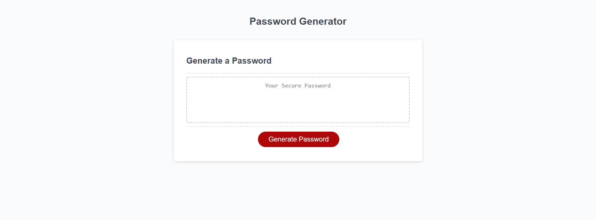
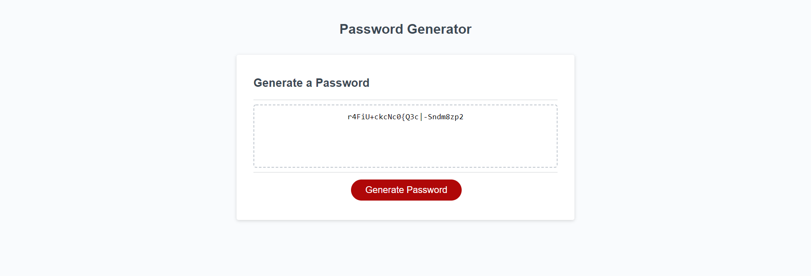
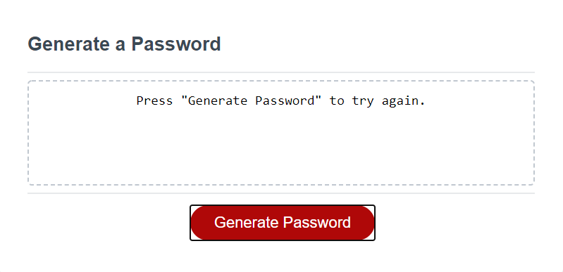
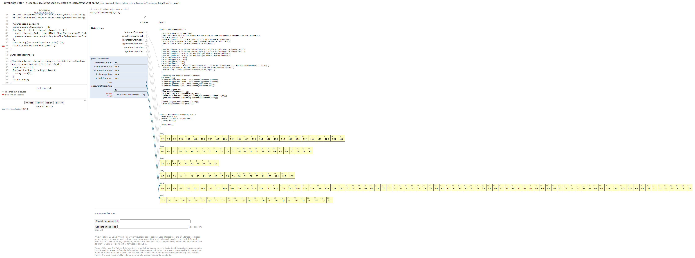

# PASSWORD GENERATOR
This project was awesome! One of the most valuable tools I learned while doing research was the ".fromCharCode" method. It in combination with "const" (which should totally be taught in the lesson, maybe it will be later) and the .concat made generating this project very simple, for me at least. I have a small background in Java so the logic and variable portions were easy enough. I had a blast figuring out how to use the .fromCharCode to make a nice clean final product.

## LINK TO GITHUB
Click **[HERE](https://github.com/adamlsn/password-gen)**

## LINK TO LIVE APPLICATION
Click **[HERE](https://adamlsn.github.io/password-gen/)**

## SCREENSHOTS

**FULL PAGE**

**AFTER GENERATION**

**ERROR MESSAGE**

**SHOWING LOGIC, VIA [pyhtontutor.com](shorturl.at/sBESY)**

Click link above to play with logic in real time, modified to work with browser limitations
